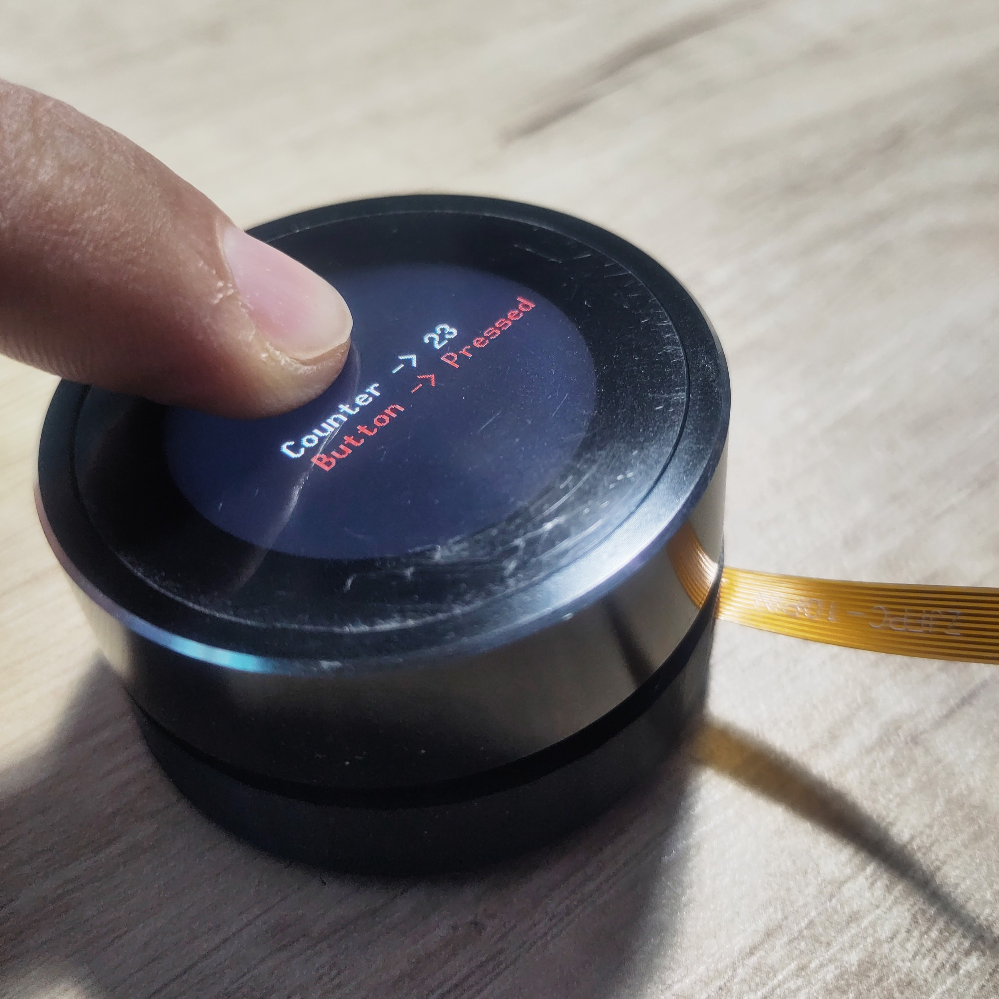

## Learning how to program `esp32c3` with Rust & IDF bindings

Rust embedded example code for a 1.3" Push knob rotary module, which includes:
- esp32-c3 MCU
- 1.3" 240x240 TFT display
- gc9a01 display controller
- standard rotary encoder built around the display

Additionally a 3d printable enclosure is designed to hold the display and rotary encoder & protect the ribbon when messing around with the module. 
(see `assets/` folder)

GPIO pin connections are fixed in this module and I got them from IDF example code available here: https://github.com/VIEWESMART/ESP32-IDF/tree/main/examples/1.3inch/UEDX24240013-MD50E-SDK (see `main.rs` for details)

- Generated from https://github.com/esp-rs/esp-idf-template
